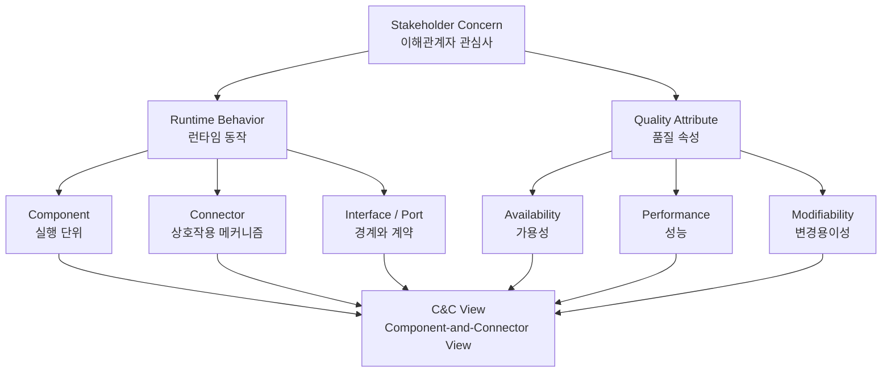
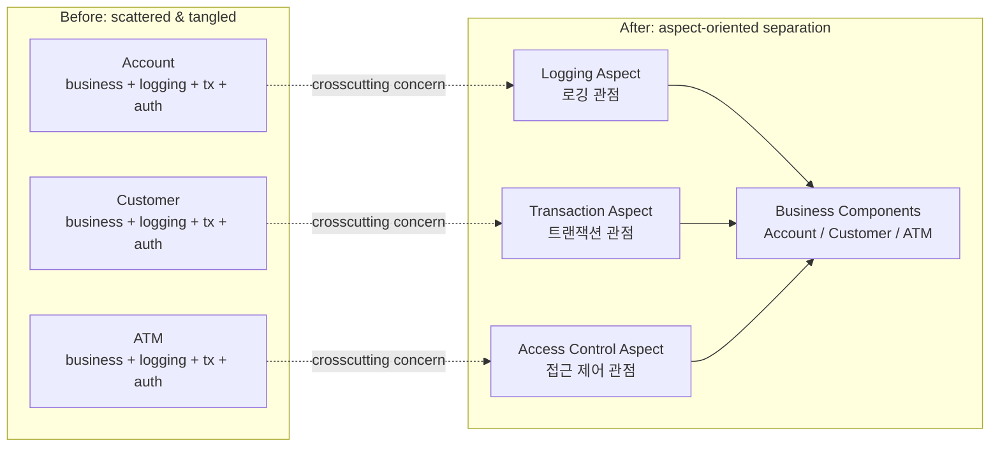
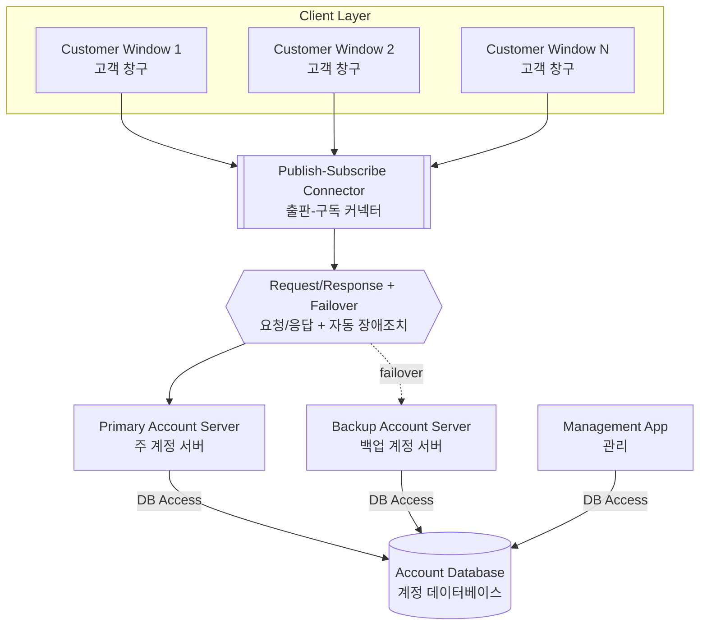
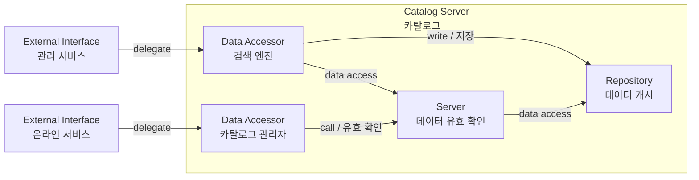
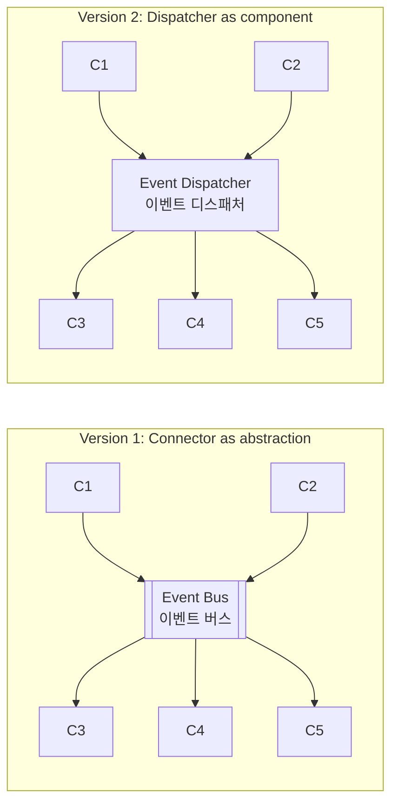
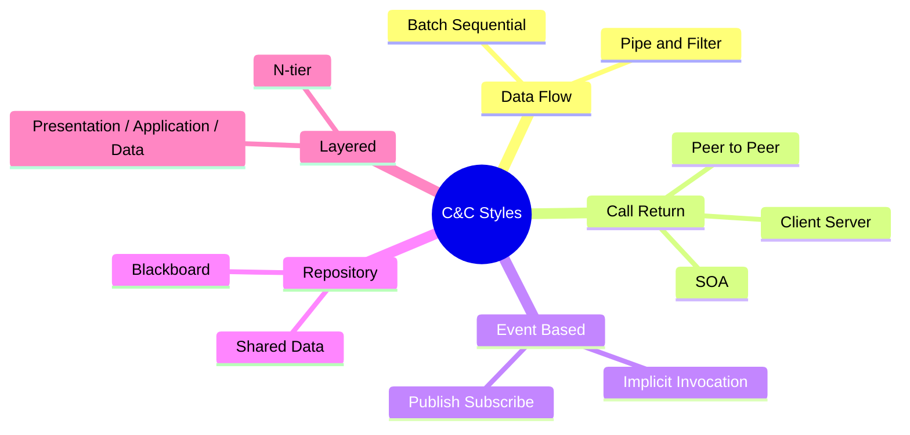
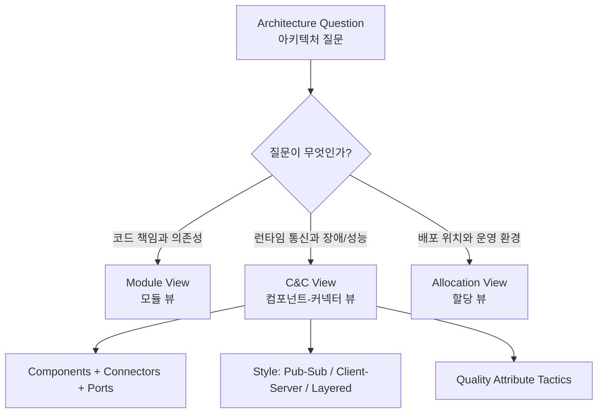

# C&C 뷰와 커넥터 스타일

> 첨부 이미지들은 모두 <strong>Component-and-Connector View(C&C View, 컴포넌트-커넥터 뷰)</strong>를 읽는 감각을 보여준다. 핵심은 “코드가 어떤 파일/클래스에 들어 있는가”가 아니라, <strong>런타임에 어떤 실행 단위가 어떤 상호작용으로 품질 속성을 만든다</strong>를 문서화하는 것이다.

## 1. 이미지에서 보이는 것

첨부한 책 페이지들은 다음 주제를 다룬다.

- <strong>Aspect-Oriented Programming(AOP, 관점지향 프로그래밍)</strong>
  - 로깅(logging), 접근 제어(access control), 트랜잭션 관리(transaction management) 같은 <strong>crosscutting concern(횡단 관심사)</strong>가 여러 클래스에 흩어지고(scattered), 업무 로직과 뒤섞이는(tangled) 문제를 설명한다.
  - AOP는 이런 관심사를 <strong>aspect(관점)</strong>로 모아 업무 코드와 분리하려는 구현 패러다임이다.
- <strong>Runtime Architecture(런타임 아키텍처)의 C&C 기본 표기</strong>
  - 고객 창구(client), 주/백업 계정 서버(server), 계정 데이터베이스(database), 관리 애플리케이션(database application) 같은 실행 요소와 연결을 보여준다.
  - 출판-구독(pub-sub), 요청/응답(request/response), 데이터베이스 접근(DB access) 같은 <strong>connector(커넥터)</strong>가 런타임 관계를 표현한다.
- <strong>Interface Delegation(인터페이스 위임)</strong>
  - 내부 포트(internal port)를 외부 포트(external port)나 connector role(커넥터 역할)에 매핑해, 컴포넌트 내부 구조와 외부 인터페이스의 관계를 문서화한다.
- <strong>Connector Abstraction(커넥터 추상화) 선택</strong>
  - 같은 출판-구독 구조도 “이벤트 버스 하나”로 표현할지, “이벤트 디스패처 컴포넌트 + 연결 집합”으로 표현할지 선택할 수 있다.
  - 선택 기준은 <strong>얼마나 많은 구현 구조를 노출할 것인가</strong>이다.
- <strong>C&C Style Taxonomy(C&C 스타일 분류)</strong>
  - 데이터 흐름, 호출-반환, 이벤트 기반, 레파지토리, 계층 같은 C&C 스타일을 분류한다.
- <strong>예제 시스템 뷰</strong>
  - ArchE UI 이벤트 관리자, J2EE/Adventure Builder 같은 사례를 통해 파일, UI 이벤트, 세션 빈, EJB tier, database tier 사이의 런타임/배포 관계를 보여준다.

## 2. 왜 C&C View가 필요한가

Module View(모듈 뷰)는 소스 코드의 정적 분해를 보여주기 좋다. 하지만 다음 질문에는 부족하다.

- 런타임에 어떤 컴포넌트가 실제로 통신하는가?
- 장애가 발생하면 어떤 경로로 전파되는가?
- 성능 병목은 어느 connector(커넥터)에서 생기는가?
- 비동기 이벤트, pub-sub, DB 접근, 원격 호출이 어디에서 일어나는가?
- 하나의 crosscutting concern(횡단 관심사)이 여러 런타임 요소에 어떻게 적용되는가?

C&C View는 이 질문에 답하기 위해 <strong>component(컴포넌트)</strong>, <strong>connector(커넥터)</strong>, <strong>port(포트)</strong>, <strong>role(역할)</strong>, <strong>interface(인터페이스)</strong>를 사용한다.

## 3. AOP 관점: 흩어진 코드와 산재한 코드

첫 번째 이미지는 Account, Customer, Atm 같은 클래스 안에 접근 제어, 로깅, 트랜잭션 관리 코드가 반복적으로 섞이는 모습을 보여준다.

이 구조의 문제는 다음과 같다.

- <strong>Scattering(흩어짐)</strong>: 하나의 관심사가 여러 클래스에 퍼져 있다.
- <strong>Tangling(뒤섞임)</strong>: 업무 로직과 횡단 관심사 코드가 한 메서드 안에 섞인다.
- <strong>Change Amplification(변경 증폭)</strong>: 로깅 signature(시그니처)나 transaction policy(트랜잭션 정책)가 바뀌면 여러 클래스를 동시에 수정해야 한다.
- <strong>Local Reasoning 저하</strong>: Account의 핵심 책임을 읽으려 해도 보안/로깅/트랜잭션 코드가 시야를 방해한다.

AOP는 구현 기술이지만, 아키텍처 관점에서는 <strong>concern allocation(관심사 배치)</strong> 문제다. 즉, 어떤 관심사를 어느 module(모듈), component(컴포넌트), connector(커넥터), middleware(미들웨어)에 둘 것인지 결정하는 문제다.

## 4. 런타임 C&C View 읽기

런타임 C&C View는 실행 중 시스템의 주요 참여자와 통신 방식을 보여준다. 은행 자동화 예제는 다음과 같이 읽을 수 있다.

- 고객 창구는 계정 서버와 요청/응답으로 통신한다.
- 주 계정 서버와 백업 계정 서버는 계정 데이터베이스에 접근한다.
- 관리 애플리케이션은 계정 데이터베이스를 관리한다.
- 고객 창구들은 출판-구독 커넥터를 통해 계정 서버와 느슨하게 결합될 수 있다.
- 자동 장애조치(failover)가 있다면 connector의 의미는 단순 호출이 아니라 가용성 전술까지 포함한다.

이 다이어그램에서 중요한 것은 박스보다 선이다. C&C View에서는 connector가 다음 의미를 갖는다.

- 동기/비동기 여부
- 호출-반환(call-return), 이벤트(event), 스트림(stream), 공유 데이터(shared data) 여부
- 오류 처리, retry, timeout, failover 의미
- 프로토콜, 메시지 형식, transaction boundary(트랜잭션 경계)
- 보안, 인증, 권한 확인 위치

## 5. Interface Delegation 읽기

Interface Delegation(인터페이스 위임)은 “외부에 보이는 interface(인터페이스)가 내부 구조의 어느 port(포트) 또는 connector role(역할)에 연결되는가”를 설명한다.

이미지의 카탈로그 예제는 대략 다음처럼 읽을 수 있다.

- 외부 `관리 서비스` 요청은 내부 `검색 엔진` data accessor로 위임된다.
- 외부 `온라인 서비스` 요청은 내부 `카탈로그 관리자` data accessor로 위임된다.
- `카탈로그` 서버 내부에서 데이터 접근, 저장, 유효성 확인, 캐시 저장소가 서로 다른 connector로 연결된다.
- 외부 인터페이스 하나가 내부에서는 여러 component/connector의 조합으로 실현된다.

이 뷰는 public API 문서와 다르다. 목적은 사용법이 아니라 <strong>외부 계약과 내부 구조 사이의 traceability(추적성)</strong>를 남기는 것이다.

## 6. Connector Abstraction 선택

출판-구독 시스템은 두 가지 수준으로 표현할 수 있다.

### 버전 1: 커넥터 하나로 추상화

- 이벤트 버스를 connector 하나로 표현한다.
- 복잡한 상호작용을 숨기고 전체 구조를 단순하게 보여준다.
- 아키텍처 리뷰에서 이벤트 기반 결합 구조를 빠르게 설명하기 좋다.

### 버전 2: 디스패처 컴포넌트로 구체화

- 이벤트 디스패처를 별도 component(컴포넌트)로 드러낸다.
- 디스패처가 병목인지, 장애 지점인지, scale-out 대상인지 분석하기 좋다.
- 운영/성능/가용성 논의에는 더 적합하다.

선택 기준은 “무엇을 숨기고 무엇을 드러낼 것인가”다.

- 개념 설명: connector 하나로 추상화
- 성능/장애 분석: 디스패처를 component로 노출
- 구현 할당: 디스패처, broker, topic, queue, subscription을 더 상세히 표현
- 변경 영향 분석: publisher/subscriber dependency(의존성)와 event schema(이벤트 스키마)를 표시

## 7. C&C Style Taxonomy

이미지의 스타일 분류는 C&C View가 하나의 표기법이 아니라 여러 architectural style(아키텍처 스타일)의 집합임을 보여준다.

주요 스타일은 다음과 같이 정리할 수 있다.

- <strong>Data Flow Style(데이터 흐름 스타일)</strong>
  - batch sequential(배치 순차), pipe-and-filter(파이프-필터)
  - 데이터 변환 파이프라인, ETL, compiler pipeline에 적합
- <strong>Call-Return Style(호출-반환 스타일)</strong>
  - client-server(클라이언트-서버), peer-to-peer(P2P), SOA
  - 요청/응답 API, RPC, service orchestration에 적합
- <strong>Event-Based Style(이벤트 기반 스타일)</strong>
  - publish-subscribe(출판-구독), implicit invocation(암시적 호출)
  - 느슨한 결합, 확장성, 비동기 처리에 적합
- <strong>Repository Style(레파지토리 스타일)</strong>
  - shared data(공유 데이터), blackboard(블랙보드)
  - 중앙 데이터 저장소를 중심으로 협업하는 구조에 적합
- <strong>Layered Style(계층 스타일)</strong>
  - n-tier, presentation/application/data 분리
  - 의존성 방향과 책임 분리를 강조할 때 적합

## 8. C&C View 작성 체크리스트

새 시스템을 문서화할 때는 다음 순서로 정리하면 좋다.

1. <strong>Concern(관심사) 선택</strong>
   - 성능, 가용성, 보안, 변경용이성, 운영성 중 어떤 질문에 답할 것인지 먼저 정한다.
2. <strong>Component(컴포넌트) 식별</strong>
   - 런타임에 독립적으로 실행되거나 배포/스케일/장애 경계가 되는 단위를 고른다.
3. <strong>Connector(커넥터) 명명</strong>
   - 단순한 선을 긋지 말고 `REST`, `JDBC`, `event`, `pub-sub`, `DB access`, `file I/O`처럼 상호작용 의미를 붙인다.
4. <strong>Interface/Port(인터페이스/포트) 표시</strong>
   - 외부에 노출되는 계약과 내부 위임 관계가 중요한 경우 포트를 표시한다.
5. <strong>Style(스타일) 선언</strong>
   - 이 뷰가 client-server인지, pub-sub인지, layered인지 명시한다.
6. <strong>품질 속성 연결</strong>
   - failover, retry, cache, queue, load balancing 같은 전술을 connector나 component에 표시한다.
7. <strong>추상화 수준 검토</strong>
   - 너무 자세하면 읽기 어렵고, 너무 추상적이면 의사결정에 쓸 수 없다.

## 9. Module View와의 구분

C&C View를 클래스 다이어그램처럼 그리면 목적을 잃는다. 다음처럼 구분하면 된다.

- <strong>Module View(모듈 뷰)</strong>
  - 관심: 소스 코드 분해, 책임, 패키지, 레이어, dependency rule(의존성 규칙)
  - 질문: “어느 코드가 어디에 속하는가?”
- <strong>C&C View(컴포넌트-커넥터 뷰)</strong>
  - 관심: 런타임 실행 요소, 통신, 프로토콜, 이벤트, 장애/성능 경로
  - 질문: “실행 중 무엇이 무엇과 어떻게 상호작용하는가?”
- <strong>Allocation View(할당 뷰)</strong>
  - 관심: 배포 노드, 팀, 파일시스템, 인프라, 환경
  - 질문: “이 요소가 어디에 배치되는가?”

## 10. 실무 적용 포인트

Android/Kotlin/Compose나 서버 시스템을 문서화할 때도 같은 원칙을 적용할 수 있다.

- UI 이벤트, ViewModel, UseCase, Repository, DataSource의 관계는 단순 class dependency가 아니라 <strong>runtime interaction(런타임 상호작용)</strong>으로 볼 수 있다.
- Flow/Coroutine/Channel/EventBus는 connector로 명명할 수 있다.
- Retrofit/Room/DataStore 접근은 `HTTP`, `DB access`, `local persistence` connector로 표현할 수 있다.
- 로그인, 로깅, 트랜잭션, 권한 같은 관심사는 AOP가 아니더라도 interceptor, middleware, decorator, policy object로 분리할 수 있다.
- 문서에는 반드시 “이 선이 무엇을 의미하는가”를 legend(범례)로 남겨야 한다.

## 참고자료

- SEI, *Documenting Software Architectures: Views and Beyond*
- SEI, *Software Architecture in Practice*
- AspectJ Documentation, Aspect-Oriented Programming concepts
- UML Component Diagram and connector/interface notation
