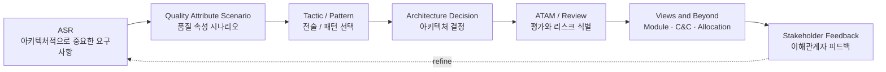
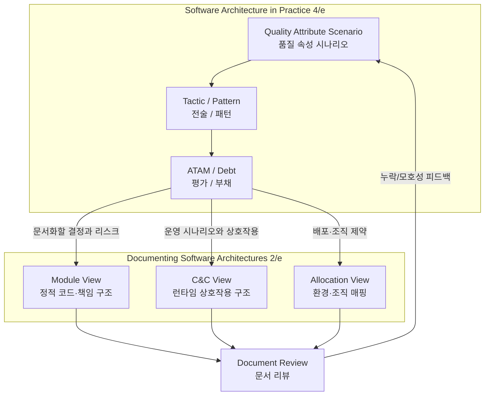
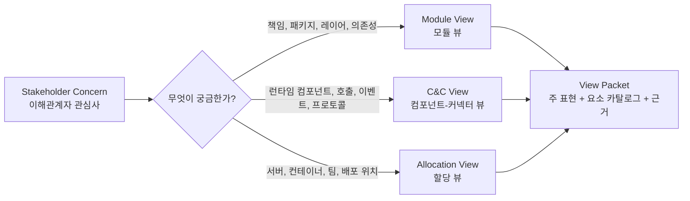

# SEI 아키텍처 핵심 서적

이 문서는 SEI(Carnegie Mellon Software Engineering Institute) 계열에서 널리 인용되는 두 권의 소프트웨어 아키텍처 서적을 빠르게 파악하기 위한 공개 노트다.

- Software Architecture in Practice, 4th Edition: 아키텍처 이론과 실제 적용 전반을 다루는 입문-실무 교과서
- Documenting Software Architectures: Views and Beyond, 2nd Edition: 아키텍처 문서화(documentation)와 뷰(view) 구성 방법에 집중한 실무 지침서

## 빠른 요약

- **Software Architecture in Practice 4/e**는 “무엇을 설계·평가할 것인가?”에 답한다. 핵심은 Quality Attribute Scenario(품질 속성 시나리오), Tactic(전술), Pattern(패턴), ATAM(아키텍처 트레이드오프 분석 방법), Architecture Debt(아키텍처 부채)다.
- **Documenting Software Architectures 2/e**는 “그 결정을 누구에게 어떤 view(뷰)로 설명할 것인가?”에 답한다. 핵심은 Module View(모듈 뷰), Component-and-Connector View(C&C 뷰), Allocation View(할당 뷰), View Packet(뷰 패킷), Rationale(근거)다.
- 두 책을 함께 읽으면 **ASR(Architecturally Significant Requirement, 아키텍처적으로 중요한 요구사항) → 설계 결정 → 평가 → 문서화 → 리뷰**로 이어지는 실무 루프를 만들 수 있다.

## 1. Software Architecture in Practice, 4th Edition

- 원제: Software Architecture in Practice, Fourth Edition
- 저자: Len Bass, Paul Clements, Rick Kazman
- 출판: Addison-Wesley Professional, 2021
- 성격: Software Architecture(소프트웨어 아키텍처)의 정의, Quality Attribute(품질 속성), 설계/평가/문서화/조직 역량까지 연결하는 실무 중심 교재

### 핵심 관점

이 책은 아키텍처를 단순한 고수준 구조도가 아니라, 시스템의 Quality Attribute(품질 속성), 개발 조직, 비즈니스 목표, 운영/배포 방식에 영향을 주고받는 핵심 설계 결정의 집합으로 본다.

특히 다음 흐름이 중요하다.

1. Architecture(아키텍처)가 무엇이고 왜 중요한지 정의한다.
2. Availability(가용성), Modifiability(변경용이성), Performance(성능), Security(보안) 같은 Quality Attribute(품질 속성)를 시나리오와 전술(tactic)로 구체화한다.
3. Interface(인터페이스), Virtualization(가상화), Cloud(클라우드), Mobile(모바일) 같은 현대적 아키텍처 해법을 설명한다.
4. Architecturally Significant Requirement(아키텍처적으로 중요한 요구사항), 설계, 평가, 문서화, Architecture Debt(아키텍처 부채)를 실무 프로세스와 연결한다.
5. Architect(아키텍트)의 역할과 Architecture Competence(아키텍처 역량)를 조직 차원에서 다룬다.

### 목차와 대략적 내용

#### Part I. Introduction

- Chapter 1. What Is Software Architecture?
  - Software Architecture(소프트웨어 아키텍처)의 정의, structure(구조), view(뷰), 좋은 아키텍처의 조건을 설명한다.
- Chapter 2. Why Is Software Architecture Important?
  - 아키텍처가 품질 속성, 변경 관리, 이해관계자 커뮤니케이션, 초기 의사결정, 구현 제약, 조직 구조, 비용/일정 추정에 미치는 영향을 다룬다.

#### Part II. Quality Attributes

- Chapter 3. Understanding Quality Attributes
  - Quality Attribute Scenario(품질 속성 시나리오), architectural pattern(아키텍처 패턴), tactic(전술), tactics-based questionnaire(전술 기반 질문지)의 기본 틀을 설명한다.
- Chapter 4. Availability
  - fault(결함), failure(장애), recovery(복구), redundancy(중복화), monitoring(모니터링) 등 가용성 확보 전술을 다룬다.
- Chapter 5. Deployability
  - Continuous Deployment(지속적 배포), 배포 가능성, 롤백/점진 배포/배포 파이프라인을 아키텍처 속성으로 본다.
- Chapter 6. Energy Efficiency
  - 에너지 소비를 품질 속성으로 정의하고 측정/제어/자원 관리 전술을 설명한다.
- Chapter 7. Integrability
  - 시스템 구성요소를 통합하기 쉬운 구조, 인터페이스 명확성, 의존성 관리, 통합 리스크를 다룬다.
- Chapter 8. Modifiability
  - 변경 영향 범위 축소, 결합도 감소, 추상화, 정보 은닉, 확장 지점 설계 등을 다룬다.
- Chapter 9. Performance
  - 응답 시간, 처리량, 자원 경합, 스케줄링, 캐싱, 병렬 처리 등 성능 전술을 설명한다.
- Chapter 10. Safety
  - 위험 식별, fault containment(결함 격리), fail-safe(안전 실패), hazard analysis(위험 분석) 관점의 전술을 다룬다.
- Chapter 11. Security
  - 인증, 인가, 기밀성, 무결성, 감사, 공격 탐지/저항/복구 전술을 설명한다.
- Chapter 12. Testability
  - 관찰 가능성(observability), 제어 가능성(controllability), 테스트 격리, 자동화 가능성을 아키텍처 관점에서 다룬다.
- Chapter 13. Usability
  - 사용자 작업 지원, 피드백, 오류 복구, 사용자 주도 제어 등 사용성 관련 전술을 다룬다.
- Chapter 14. Working with Other Quality Attributes
  - 앞 장에서 다루지 않은 품질 속성을 식별하고, 시나리오/전술/질문지 방식으로 확장하는 방법을 설명한다.

#### Part III. Architectural Solutions

- Chapter 15. Software Interfaces
  - Interface(인터페이스)를 계약(contract)과 상호작용 경계로 보고, 문서화와 품질 속성에 미치는 영향을 설명한다.
- Chapter 16. Virtualization
  - 가상화, 컨테이너, 자원 격리, 배포 유연성 등 실행 환경 추상화가 아키텍처에 주는 영향을 다룬다.
- Chapter 17. The Cloud and Distributed Computing
  - Cloud(클라우드), 분산 시스템, 탄력성, 장애 처리, 네트워크 지연, 관리형 서비스 활용을 설명한다.
- Chapter 18. Mobile Systems
  - 모바일 환경의 자원 제약, 네트워크 변동성, 사용자 경험, 에너지, 오프라인 동작을 다룬다.

#### Part IV. Scalable Architecture Practices

- Chapter 19. Architecturally Significant Requirements
  - ASR(Architecturally Significant Requirement, 아키텍처적으로 중요한 요구사항)을 발견하고 품질 속성 시나리오로 정제하는 방법을 다룬다.
- Chapter 20. Designing an Architecture
  - 요구사항과 제약을 기반으로 아키텍처를 설계하고, 패턴/전술/트레이드오프를 선택하는 과정을 설명한다.
- Chapter 21. Evaluating an Architecture
  - ATAM(Architecture Tradeoff Analysis Method, 아키텍처 트레이드오프 분석 방법) 등 평가 접근을 통해 리스크와 민감점(sensitivity point)을 찾는다.
- Chapter 22. Documenting an Architecture
  - 아키텍처 문서화의 목적, view(뷰), stakeholder(이해관계자), documentation package(문서 패키지)를 설명한다.
- Chapter 23. Managing Architecture Debt
  - Architecture Debt(아키텍처 부채)를 식별, 기록, 우선순위화, 상환하는 실무 방법을 다룬다.

#### Part V. Architecture and the Organization

- Chapter 24. The Role of Architects in Projects
  - Architect(아키텍트)의 책임, 프로젝트 내 협업, 의사소통, 의사결정 리더십을 다룬다.
- Chapter 25. Architecture Competence
  - 개인/팀/조직 차원의 Architecture Competence(아키텍처 역량)를 성장시키는 방법을 설명한다.

#### Part VI. Conclusions

- Chapter 26. A Glimpse of the Future: Quantum Computing
  - Quantum Computing(양자 컴퓨팅)이 향후 소프트웨어 아키텍처에 줄 수 있는 영향을 개괄한다.

### 실무 적용 포인트

- 품질 속성은 추상 명사가 아니라 Quality Attribute Scenario(품질 속성 시나리오)로 작성해야 한다.
- 아키텍처 설계는 패턴 이름을 붙이는 작업이 아니라, 품질 속성 간 Trade-off(트레이드오프)를 의식적으로 선택하는 작업이다.
- 설계, 평가, 문서화는 분리된 산출물이 아니라 하나의 피드백 루프다.
- Agile(애자일), DevOps(데브옵스), Cloud(클라우드) 환경에서도 아키텍처는 사라지는 것이 아니라 더 짧은 주기와 더 강한 피드백으로 관리되어야 한다.

## 2. Documenting Software Architectures, 2nd Edition

- 원제: Documenting Software Architectures: Views and Beyond, Second Edition
- 저자: Paul Clements, Felix Bachmann, Len Bass, David Garlan, James Ivers, Reed Little, Paulo Merson, Robert Nord, Judith Stafford
- 출판: Addison-Wesley Professional, 2010
- 성격: Views and Beyond(V&B) 접근을 중심으로 아키텍처 문서를 어떤 view(뷰)로 구성하고, 각 view에 무엇을 써야 하며, 어떻게 검토할지 설명하는 문서화 전문서

### 핵심 관점

이 책은 아키텍처 문서화를 “그림 몇 장을 남기는 일”이 아니라, stakeholder(이해관계자)의 정보 요구를 만족시키는 구조화된 communication artifact(커뮤니케이션 산출물)를 만드는 일로 본다.

핵심 개념은 다음과 같다.

- View(뷰): 특정 관심사에 맞춰 아키텍처 구조를 표현한 것
- Viewtype(뷰타입): Module(모듈), Component-and-Connector(C&C, 컴포넌트-커넥터), Allocation(할당)처럼 구조를 바라보는 큰 분류
- Style(스타일): 각 viewtype 안에서 element(요소), relation(관계), property(속성), constraint(제약)을 정한 표현 방식
- Beyond Views(뷰 너머 정보): context diagram(컨텍스트 다이어그램), variability(변동성), rationale(근거), view 간 mapping(매핑)처럼 단일 view만으로는 부족한 정보

### 목차와 대략적 내용

#### Prologue. Software Architectures and Documentation

- Software Architecture(소프트웨어 아키텍처)와 Architecture Documentation(아키텍처 문서화)의 기본 개념을 정리한다.
- 왜 문서화가 필요한지, 누가 사용하는지, 품질 속성과 어떤 관계가 있는지 설명한다.
- Views and Beyond Method(V&B 방법), agile environment(애자일 환경)에서의 문서화, 빠르게 변하는 아키텍처를 다루는 방법을 소개한다.
- 좋은 문서화를 위한 “Seven Rules for Sound Documentation(건전한 문서화를 위한 7가지 규칙)”를 제시한다.

#### Part I. A Collection of Software Architecture Styles

- Part I Introduction
  - 세 가지 Viewtype(뷰타입): Module(모듈), Component-and-Connector(C&C), Allocation(할당)을 소개한다.
  - style guide(스타일 가이드) 형식, 요소/관계/속성 선택, notation(표기법), 예제 사용 방식을 설명한다.
- Chapter 1. Module Views
  - 코드/설계 단위의 정적 구조를 표현한다. module, relation, property, notation, 다른 view와의 관계를 설명한다.
- Chapter 2. A Tour of Some Module Styles
  - Decomposition(분해), Uses(사용), Generalization(일반화), Layered(계층), Aspects(관점), Data Model(데이터 모델) 스타일을 설명한다.
- Chapter 3. Component-and-Connector Views
  - 런타임 구성요소와 상호작용 구조를 표현한다. component, connector, port, role, protocol 등을 다룬다.
- Chapter 4. A Tour of Some Component-and-Connector Styles
  - Data Flow(데이터 흐름), Call-Return(호출-반환), Event-Based(이벤트 기반), Repository(저장소) 스타일과 교차 관심사를 다룬다.
- Chapter 5. Allocation Views and a Tour of Some Allocation Styles
  - 소프트웨어 요소가 환경에 어떻게 매핑되는지 표현한다. Deployment(배포), Install(설치), Work Assignment(작업 할당) 스타일을 설명한다.

#### Part II. Beyond Structure: Completing the Documentation

- Chapter 6. Beyond the Basics
  - refinement(정제), completeness(완전성), context diagram(컨텍스트 다이어그램), variation point(변동 지점), architectural decision(아키텍처 결정), view 결합을 다룬다.
- Chapter 7. Documenting Software Interfaces
  - 인터페이스 문서의 표준 구성, 이해관계자, syntactic information(구문 정보), semantic information(의미 정보), 예제를 설명한다.
- Chapter 8. Documenting Behavior
  - 정적 구조만으로 부족한 behavior(동작)를 어떻게 문서화할지 설명한다. 상태, 시퀀스, 상호작용, 동작 표기법을 다룬다.

#### Part III. Building the Architecture Documentation

- Chapter 9. Choosing the Views
  - 이해관계자와 문서 요구를 기반으로 어떤 view를 선택할지 결정하는 방법을 제시한다.
- Chapter 10. Building the Documentation Package
  - view 문서 템플릿, view 밖의 공통 정보, 요구사항 매핑, 문서 패키징 방식을 설명한다.
- Chapter 11. Reviewing an Architecture Document
  - 아키텍처 문서를 검토하는 절차와 질문 세트, 리뷰 수행 예제를 제공한다.

#### Epilogue. Using Views and Beyond with Other Approaches

- ISO/IEC/IEEE 42010, Kruchten 4+1, Rozanski and Woods viewpoint set, Agile(애자일), DoDAF(미 국방 아키텍처 프레임워크) 등 다른 접근과 V&B를 연결한다.
- 아키텍처 문서화의 경계와 최종 조언을 제공한다.

#### Appendices

- Appendix A. UML(Unified Modeling Language)
  - UML로 Module View, C&C View, Allocation View, Behavior, Interface를 표현하는 방법을 설명한다.
- Appendix B. SysML(Systems Modeling Language)
  - SysML을 이용한 요구사항, 모듈, C&C, 할당, 동작, 인터페이스 문서화를 다룬다.
- Appendix C. AADL(SAE Architecture Analysis and Design Language)
  - AADL을 이용한 모듈, C&C, 배포, 동작, 인터페이스 문서화를 소개한다.

### 실무 적용 포인트

- 문서화는 “가능한 모든 것을 쓰기”가 아니라 stakeholder concern(이해관계자 관심사)에 맞는 view를 선택하는 일이다.
- Module View(모듈 뷰)와 C&C View(컴포넌트-커넥터 뷰)는 반드시 구분해서 작성해야 한다. 전자는 정적 코드/책임 구조, 후자는 런타임 상호작용 구조에 가깝다.
- 각 view는 Primary Presentation(주 표현), Element Catalog(요소 카탈로그), Context Diagram(컨텍스트 다이어그램), Variability Guide(변동성 가이드), Rationale(근거)를 포함하는 방식으로 정리할 수 있다.
- 문서 자체도 리뷰 대상이다. 아키텍처 리뷰와 별개로, 문서가 의사결정/구현/테스트/운영에 충분한 정보를 주는지 검토해야 한다.

## 3. 두 책의 관계

- **주제**
  - Software Architecture in Practice 4/e: 아키텍처 이론과 실무 전체
  - Documenting Software Architectures 2/e: 아키텍처 문서화 전문
- **중심 질문**
  - Software Architecture in Practice 4/e: 좋은 아키텍처를 어떻게 설계, 평가, 운영할 것인가?
  - Documenting Software Architectures 2/e: 아키텍처를 누구에게, 어떤 view(뷰)로, 얼마나 정확히 설명할 것인가?
- **핵심 도구**
  - Software Architecture in Practice 4/e: Quality Attribute Scenario(품질 속성 시나리오), Tactic(전술), Pattern(패턴), ATAM(아키텍처 트레이드오프 분석 방법), Architecture Debt(아키텍처 부채)
  - Documenting Software Architectures 2/e: Views and Beyond(V&B), Viewtype(뷰타입), Style(스타일), View Packet(뷰 패킷), Documentation Package(문서 패키지)
- **실무 산출물**
  - Software Architecture in Practice 4/e: 품질 속성 시나리오, 설계 결정, 평가 결과, 부채 목록
  - Documenting Software Architectures 2/e: 모듈 뷰, C&C 뷰, 할당 뷰, 인터페이스 문서, 동작 문서, 리뷰 체크리스트
- **함께 쓰는 방식**
  - Software Architecture in Practice 4/e가 **무엇을 설계하고 평가할지** 정한다.
  - Documenting Software Architectures 2/e가 설계/평가 결과를 **이해관계자별로 전달 가능하게** 만든다.

### View 선택 감각

## 4. 권장 학습 순서

1. Software Architecture in Practice 4/e의 Part I을 읽어 아키텍처의 정의와 중요성을 잡는다.
2. Part II에서 Quality Attribute(품질 속성)를 시나리오와 tactic(전술) 중심으로 학습한다.
3. Documenting Software Architectures 2/e의 Prologue와 Part I을 읽어 Module/C&C/Allocation viewtype을 구분한다.
4. 실제 프로젝트 문서에 최소 2개 view를 적용한다.
   - Module View(모듈 뷰): 책임/패키지/레이어/의존성
   - C&C View(컴포넌트-커넥터 뷰): 런타임 컴포넌트/프로세스/통신/프로토콜
5. Software Architecture in Practice 4/e의 평가/부채/조직 장을 읽고, 문서가 실제 의사결정과 피드백 루프에 쓰이는지 점검한다.

## 5. 관련 레퍼런스

### 공식/출판사 자료

- [SEI - Software Architecture in Practice, 4th Edition](https://www.sei.cmu.edu/library/software-architecture-in-practice-fourth-edition/)
- [Pearson - Software Architecture in Practice, 4th Edition](https://www.pearson.com/en-us/subject-catalog/p/software-architecture-in-practice/P200000000111/9780136886099)
- [SEI - Documenting Software Architectures: Views and Beyond, Second Edition](https://www.sei.cmu.edu/library/documenting-software-architectures-views-and-beyond-second-edition/)
- [Pearson Germany - Documenting Software Architectures 2/e Table of Contents PDF](https://www.pearson.de/media/muster/toc/toc_9780132488587.pdf)

### SEI 관련 방법론

- [SEI - Architecture Tradeoff Analysis Method Collection](https://www.sei.cmu.edu/library/architecture-tradeoff-analysis-method-collection/)
- [SEI - Software Architecture](https://www.sei.cmu.edu/our-work/software-architecture/)
- [SEI Digital Library - Software Architecture Resources](https://www.sei.cmu.edu/library/?term=software%20architecture)

### 표준/보완 자료

- [ISO/IEC/IEEE 42010 Website](https://www.iso-architecture.org/ieee-1471/)
- [ISO/IEC/IEEE 42010: Systems and software engineering — Architecture description](https://www.iso.org/standard/74393.html)
- [Kruchten - The 4+1 View Model of Architecture](https://www.cs.ubc.ca/~gregor/teaching/papers/4+1view-architecture.pdf)
- [Rozanski and Woods - Software Systems Architecture](https://www.viewpoints-and-perspectives.info/)

## 참고자료

- Len Bass, Paul Clements, Rick Kazman, Software Architecture in Practice, Fourth Edition, Addison-Wesley Professional, 2021.
- Paul Clements et al., Documenting Software Architectures: Views and Beyond, Second Edition, Addison-Wesley Professional, 2010.
- [SEI - Software Architecture in Practice, 4th Edition](https://www.sei.cmu.edu/library/software-architecture-in-practice-fourth-edition/)
- [SEI - Documenting Software Architectures: Views and Beyond, Second Edition](https://www.sei.cmu.edu/library/documenting-software-architectures-views-and-beyond-second-edition/)
- [Pearson - Software Architecture in Practice, 4th Edition](https://www.pearson.com/en-us/subject-catalog/p/software-architecture-in-practice/P200000000111/9780136886099)
- [Pearson Germany - Documenting Software Architectures 2/e Table of Contents PDF](https://www.pearson.de/media/muster/toc/toc_9780132488587.pdf)
